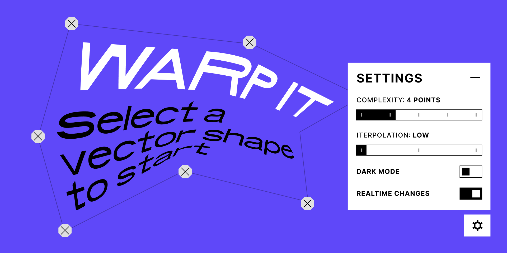

# Figma Image Editor

## 👉🏾 [DOWNLOAD PLUGIN](https://www.figma.com/community/plugin/914972720109480252/Image-Editor)

---

-   Manipulate image with many different color adjustments and filters.
-   Save and load your own presets
-   Plugin takes and keeps the original resolution of the image.

---

### 📺 [Demo video on YouTube](https://youtu.be/9dKERyUiT1c)

---

### 🎨 Color adjustments:

-   Brightness
-   Contrast
-   Hue
-   Channels
-   Exposure
-   Gamma
-   Vibrance
-   Tint

### 🚥 Filters:

-   Invert
-   Mirror
-   Noise
-   Color Halftone
-   Monochrome Halftone
-   Blur
-   Lens blur
-   Sharp

---

#### 💥 Upcoming features:

-   Show changed values
-   Bulge / Pinch warp
-   Swirl
-   Ink
-   Edge Work
-   Hexagonal Pixelate

---

#### 💸 If you want to support [the next release](https://www.paypal.com/paypalme/pavellaptev)
